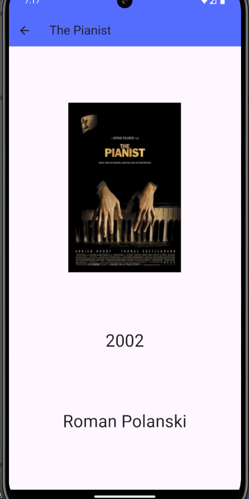

<h1>Sqlite Film Uygulaması</h1>

Uygulama, VS Code kullanılarak geliştirilmiş ve SQLite veritabanı ile entegrasyon sağlanmıştır. SQLite, uygulamada film verilerini depolamak için kullanılır. Kullanıcılar, kategoriler üzerinden filmleri görüntüleyip detaylarına ulaşırken, veritabanı işlemleri sqflite paketiyle yönetilir. Bu sayede veriler hızlı ve verimli bir şekilde erişilip işlenir..

    
    
    

